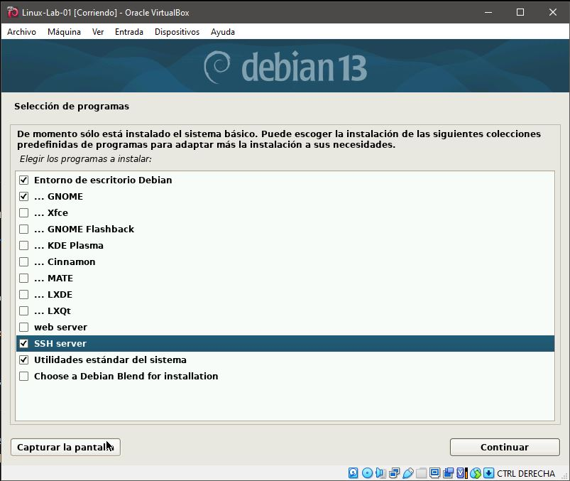
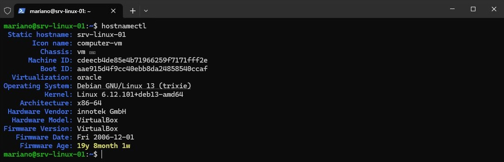
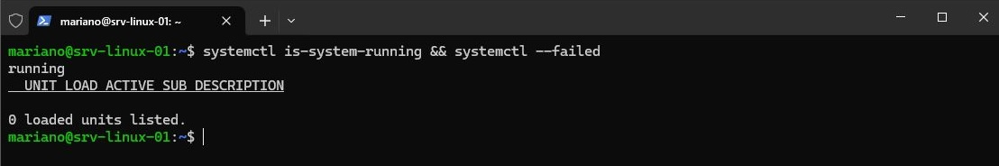
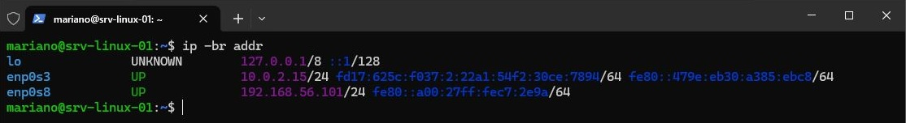
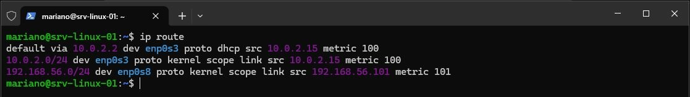
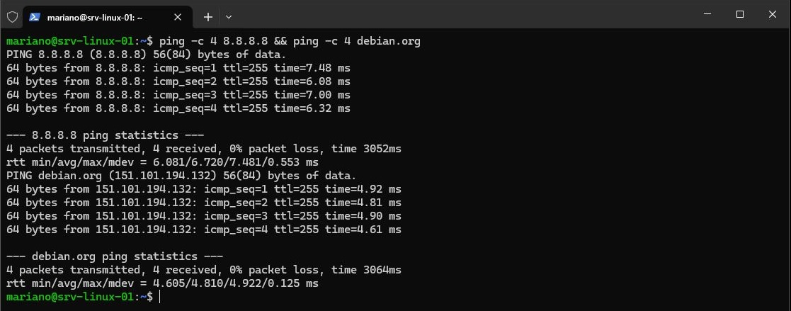
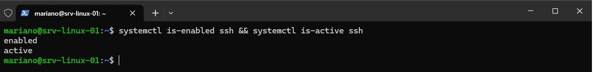
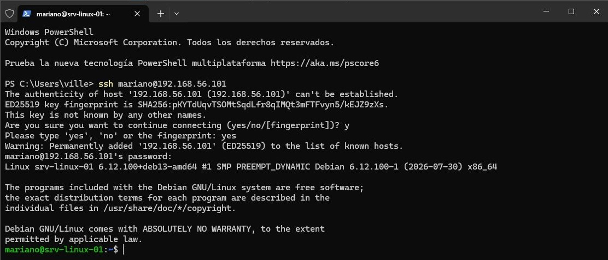
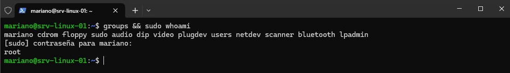
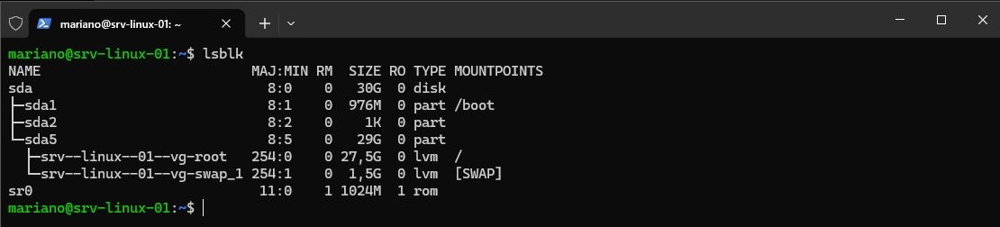

# Lab 01 - Preparación del entorno de laboratorio

## Objetivo

Preparar un entorno Linux funcional que sirva como base para los laboratorios posteriores, configurando la conectividad de red y el acceso remoto mediante SSH, y validando el correcto funcionamiento general del sistema.

## Escenario / Contexto

Se requiere disponer de un entorno Linux virtualizado para realizar prácticas de administración de sistemas de forma controlada. El servidor debe contar con conectividad a Internet y una red privada con el equipo anfitrión, permitiendo su administración remota mediante SSH desde Windows.

## Alcance

El laboratorio comprende:

- Creación de una máquina virtual en VirtualBox.
- Instalación de Debian GNU/Linux.
- Configuración de conectividad mediante adaptadores NAT y Host-Only.
- Habilitación y validación del acceso remoto mediante SSH.
- Configuración de privilegios administrativos mediante `sudo`.
- Actualización inicial del sistema.
- Validación del estado general del entorno.

## Entorno de implementación

| Componente | Configuración |
|---|---|
| Hipervisor | VirtualBox |
| Máquina virtual | `Linux-Lab-01` |
| Sistema operativo | Debian GNU/Linux 13 (Trixie) |
| Arquitectura | x86-64 |
| Memoria RAM | 4 GB |
| Procesadores | 2 vCPU |
| Disco virtual | 30 GB, VDI dinámico |
| Particionado | LVM |
| Entorno de escritorio | GNOME |
| Firmware | BIOS |
| Hostname | `srv-linux-01` |
| Usuario administrativo | `mariano` |
| Adaptador 1 | NAT |
| IPv4 NAT | `10.0.2.15/24` |
| Gateway | `10.0.2.2` |
| Adaptador 2 | Host-Only |
| Red Host-Only | `192.168.56.0/24` |
| IPv4 Host-Only | `192.168.56.101/24` |
| Host Windows | `192.168.56.1` |
| Acceso remoto | SSH |

## Implementación

### Instalación y preparación del sistema

Se creó la máquina virtual y se instaló Debian GNU/Linux 13 (Trixie) utilizando LVM para el almacenamiento. Durante la instalación se incorporaron GNOME, OpenSSH Server y las utilidades estándar del sistema. Posteriormente, se habilitaron privilegios administrativos para el usuario mariano mediante sudo y se realizó la actualización inicial de los paquetes del sistema.

**Selección de componentes durante la instalación:**

### Configuración de red

Se configuraron dos interfaces de red con funciones diferenciadas: un adaptador NAT para proporcionar conectividad externa al servidor y un adaptador Host-Only para establecer una red privada entre la máquina virtual y el equipo anfitrión. Esta última se utiliza para la administración remota del servidor sin depender de la conectividad a Internet.

### Acceso remoto y administración

Se habilitó el servicio SSH para permitir la administración remota del servidor. El acceso se realiza desde PowerShell en el equipo Windows anfitrión utilizando la dirección IP de la interfaz Host-Only. El usuario `mariano` dispone de privilegios administrativos mediante `sudo`, evitando el uso habitual de la cuenta `root` para las tareas de administración.

## Validación

### Estado del sistema

Se verificó la identidad y el estado general del servidor, confirmando el hostname configurado, la versión del sistema operativo, el kernel en ejecución y la ausencia de unidades de `systemd` en estado fallido.

Se comprobó además el estado general de `systemd`, obteniendo un estado `running` y sin unidades fallidas.

### Red y conectividad

Se verificó que ambas interfaces de red se encontraran activas y con direccionamiento IPv4 asignado. También se comprobó la existencia de la ruta por defecto a través de la interfaz NAT y la conectividad externa tanto por dirección IP como mediante resolución DNS.

**Interfaces y direccionamiento de red:**

**Tabla de enrutamiento:**

**Conectividad externa y resolución DNS:**

### Acceso remoto y privilegios administrativos

Se verificó que el servicio SSH se encontrara habilitado para iniciar automáticamente y en estado activo. Posteriormente, se comprobó el acceso remoto al servidor desde PowerShell mediante la interfaz Host-Only y la capacidad del usuario `mariano` para ejecutar tareas con privilegios administrativos mediante `sudo`.

**Estado del servicio SSH:**

**Acceso remoto desde PowerShell:**

**Privilegios administrativos:**

### Almacenamiento

Se verificó la estructura de almacenamiento del sistema, confirmando el uso de LVM para los volúmenes correspondientes al sistema raíz y al área de intercambio (swap).

**Estructura de almacenamiento:**

## Conclusiones

Se completó la preparación de un entorno Linux virtualizado, con conectividad externa, acceso remoto mediante SSH y capacidad de administración mediante sudo. El sistema quedó actualizado, operativo y validado, estableciendo una base funcional para continuar con los siguientes laboratorios de administración Linux.

