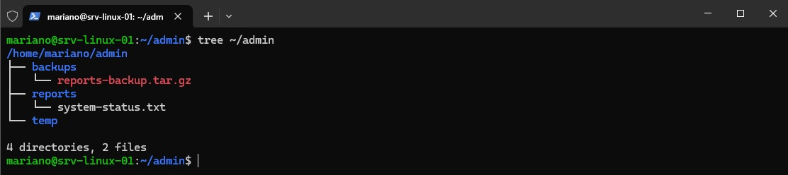
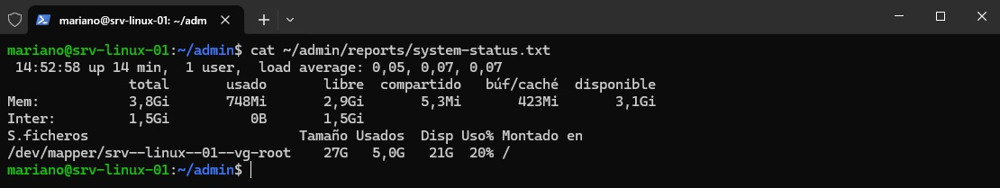
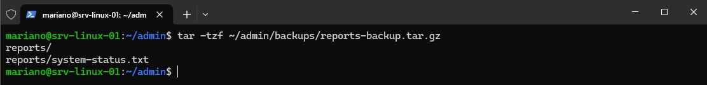
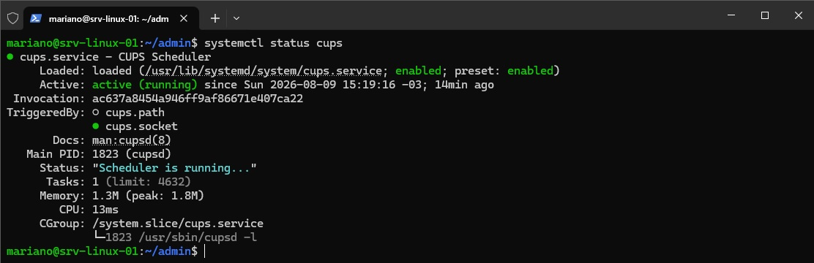
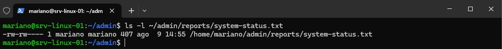

# Lab 02 - Administración básica

## Objetivo

Realizar tareas habituales de administración básica sobre el servidor Debian, organizando un espacio de trabajo administrativo y gestionando y consultando recursos, procesos, almacenamiento, paquetes, servicios, permisos y estado de red, con validación del estado final del sistema.

## Escenario / Contexto

Partiendo del servidor Debian preparado en el Lab 01, con conectividad de red y acceso remoto mediante SSH ya operativos, se realizan tareas habituales de administración orientadas a organizar el entorno de trabajo y consultar, gestionar y validar el estado de los principales recursos del sistema.

La administración se realiza de forma remota mediante SSH desde PowerShell en Windows, utilizando la consola de VirtualBox únicamente como acceso local de respaldo.

## Alcance

El laboratorio comprende:

- Organización de una estructura de directorios para tareas administrativas.
- Consulta del estado general y utilización de recursos del sistema.
- Consulta y administración básica de procesos.
- Verificación del almacenamiento y sistemas de archivos.
- Búsqueda de archivos y contenido.
- Creación y verificación de respaldos comprimidos.
- Consulta e instalación de paquetes.
- Consulta y administración de servicios mediante `systemd`.
- Verificación y modificación de permisos básicos sobre archivos.
- Consulta del estado de red, rutas y puertos en escucha.
- Validación final del estado del sistema.

## Implementación

Se creó una estructura de trabajo bajo `~/admin` destinada a centralizar archivos utilizados durante tareas administrativas. La estructura se organizó separando reportes, respaldos y archivos temporales:

- `reports/`: almacenamiento de reportes generados durante la administración.
- `backups/`: almacenamiento de copias de respaldo.
- `temp/`: espacio destinado a archivos temporales de trabajo.

Como parte de esta estructura se generó `reports/system-status.txt`, utilizado para conservar información del estado del sistema.

Para disponer de una referencia del estado general del servidor, se consultaron el tiempo de actividad y carga del sistema, la utilización de memoria y el espacio disponible en el sistema de archivos raíz.

Los resultados principales se consolidaron en `reports/system-status.txt`, permitiendo conservar una referencia del estado del servidor durante la ejecución del laboratorio.

Se revisaron los procesos en ejecución del sistema y los asociados al usuario administrativo, identificando información como PID, propietario y comando ejecutado.

También se realizó una prueba controlada del ciclo de vida de un proceso en segundo plano, iniciándolo, verificando su ejecución y finalizándolo posteriormente.

Se verificó la disposición del almacenamiento y la utilización de los sistemas de archivos, confirmando el uso de LVM para el volumen raíz y el espacio disponible en el servidor.

Posteriormente se generó un respaldo comprimido del directorio `reports/` en `backups/reports-backup.tar.gz`. Una vez creado, se verificó el contenido del archivo para confirmar que incluyera el reporte `system-status.txt`.

Se verificó el estado de instalación del paquete `tree`, comprobando inicialmente que no se encontraba disponible en el sistema. Posteriormente se instaló mediante APT y se validó su correcta instalación consultando la información registrada por el gestor de paquetes.

La herramienta instalada se utilizó posteriormente para visualizar la estructura del directorio administrativo `~/admin`.

Se revisaron los servicios activos administrados por `systemd` y se seleccionó CUPS para realizar una prueba controlada de gestión de servicios.

Se verificó su estado inicial, se detuvo el servicio y se confirmó su inactividad. Posteriormente se inició nuevamente y se validó que quedara en estado `active (running)`, preservando así su funcionamiento al finalizar la intervención.

Se revisaron los permisos y la propiedad del reporte `system-status.txt`. Como medida de control sobre el archivo, se retiró el permiso de lectura para otros usuarios, manteniendo los permisos de lectura y escritura para el propietario y el grupo.

El estado final del archivo quedó establecido como `rw-rw----`, con `mariano` como usuario y grupo propietario.

Se verificó el estado de red del servidor, comprobando las interfaces y direcciones IP asignadas, la tabla de rutas y el gateway predeterminado.

También se revisaron los puertos TCP y UDP en escucha, identificando entre ellos el puerto TCP 22 correspondiente al servicio SSH utilizado para la administración remota.

## Validación

Al finalizar las tareas de administración se verificó el estado final del entorno, comprobando:

- La estructura y el contenido de los directorios administrativos.
- La integridad del respaldo mediante la inspección de su contenido.
- El estado activo del servicio CUPS después de la intervención.
- Los permisos finales aplicados sobre `system-status.txt`.
- La ausencia de unidades de `systemd` en estado fallido.

La comprobación mediante `systemctl --failed` finalizó con `0 loaded units listed`, confirmando que no quedaron unidades en estado `failed`.

## Conclusiones

El laboratorio permitió establecer una base de administración habitual sobre el servidor Debian, incorporando una estructura organizada para archivos administrativos y realizando tareas de supervisión, gestión y verificación sobre distintos componentes del sistema.

Al finalizar, el servidor mantuvo sus servicios operativos, no presentó unidades de `systemd` en estado fallido y quedaron disponibles el reporte de estado y su respaldo verificado para futuras tareas de administración.

